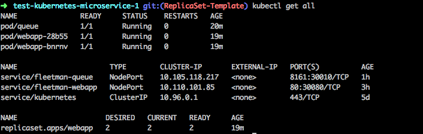

# Kubernetes Microservices
> Using Minikube

## Feature : ReplicaSet

## Get Started
Start Minikube
` minikube start`

Check IP Address
` minikube ip `

To run all yml files
` kubectl apply -f . `

To check status
` kubectl get all `

## Delete
To Delete pods
` kubectl delete po --all`

### Shorthands
pod = po
`kubectl describe po name`

service = svc
`kubectl describe svc name`

replicaSet = rs
`kubectl describe rs name`
