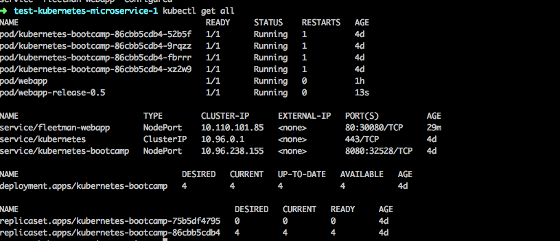

# Kubernetes Microservices
> Using Minikube

## Feature : Deployment
> Deployment handles Replica,

> Replica handles Pods




## Get Started
Start Minikube
` minikube start`

Check IP Address
` minikube ip `

To run all yml files
` kubectl apply -f . `

To check status
` kubectl get all `

## Delete
To Delete pods
` kubectl delete po --all`

** To delete every resources in a file **  
`kubectl delete -f file.yml`


### Shorthands
pod = po
`kubectl describe po name`

service = svc
`kubectl describe svc name`

replicaSet = rs
`kubectl describe rs name`

---
### Emergency Rollback

To check history
` kubectl rollout history deploy webapp `

To check status
` kubectl rollout status deploy webapp `


---

## NOTES :

### Services
** Example **

Types:
- NodePort
> For Exposing it externally (like browser)  

```yaml
apiVersion: v1
kind: Service
metadata:
    name: fleetman-position-tracker
spec:
    selector:
        app: position-tracker
    ports:
    - name: http
      port: 8080 # Container PORT
      nodePort: 30020 # External PORT
    type: NodePort

```

- ClusterIP
> For internal Use only, and you cannot specify a `nodePort`

```yaml
apiVersion: v1
kind: Service
metadata:
    name: fleetman-position-tracker
spec:
    selector:
        app: position-tracker
    ports:
    - name: http
      port: 8080 # Container PORT
    type: ClusterIP

```

---
## Troubleshooting  
> Here are some of the troubles that I have experienced during development/deployment

If minikube is not starting
```
minikube delete
minikube start
```

If the problem persist, try uninstalling and re-installing
```
brew cask uninstall minikube
brew cask install minikube
```
