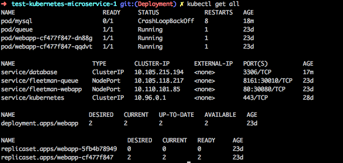

# CLI
> Kubernetes / Linux Debuggin Protocols

### Service Discovery

To see the nameserver and net serivices registered  
`cat /etc/resolve.conf`

To see the service of your Kubernetes Service use `nslookup {kubename}`

For Example:  
`nslookup database`  
> database is the name of a kubernetes service in my case

here is the response:

> Now check the Kubernetes   

Service database is at `10.105.215.194`

### Inspecting the Logs of the Pod

`kubectl logs podname-hash123`  
or
`kubectl logs pod/podname-hash123`  
